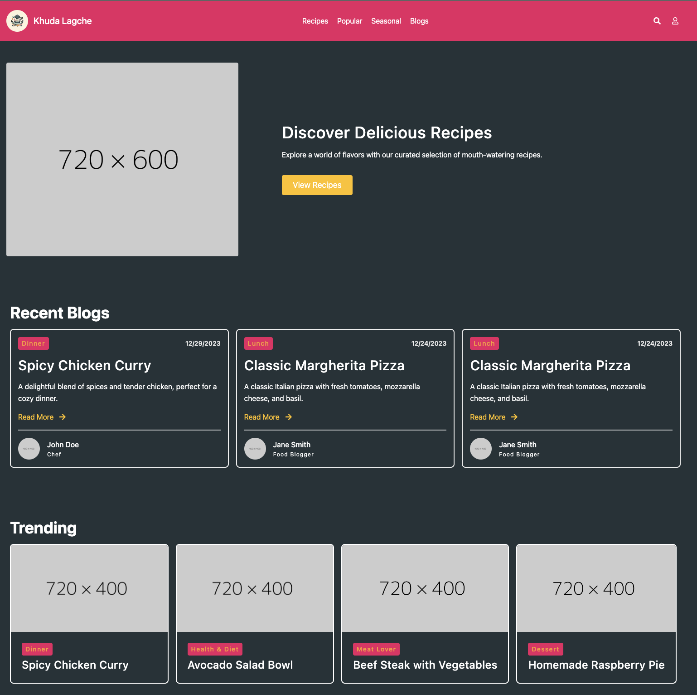
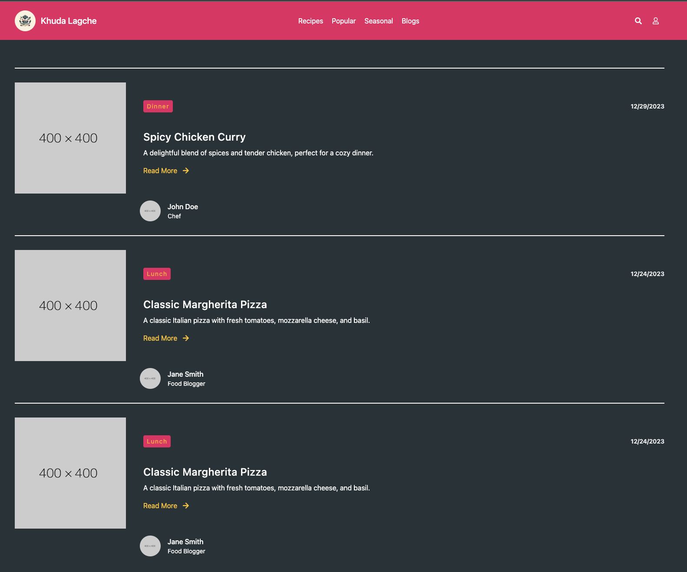

# DeepMinds

Repo for senior design 1

## Members

- [Matthew Munoz](https://www.github.com/MattMunoz) - Team Leader
- [Matthew Nieves](https://www.github.com/Nieves350) - System Savvy
- [Tajwar Rahman](https://www.github.com/thetajwar2003) - Tech Smith

## Introduction Slides

DeepMinds member introduction [slides](https://docs.google.com/presentation/d/1a_4PFULTmjSpIxwWGtVhbDTeNvAeE5SiUZxqbOzDJ4o/)

## Project Description

- Recipe App

  - The ML aspect of the project will be implemented on top of a recipe app. The recipe app will work much in the same way other recipe app works. The full details of it can be found [here](https://github.com/thetajwar2003/khuda-lagche)

- Senior Design Project
  1. The main aspect of the project will be a recommendation system that creates personalized recommendations for each user of the app. The users will obtain this personalization based on past preferences, whether it's a like or dislike, compared to what other similar users of the app prefer. For example, if two users have similar tastes in recipes and are more closely related we can assume that they will like a similar recipe in the future, so if one of them likes a recipe the other one has not tried we can recommend said recipe to the other user.

  2. If time permits, the project will also attempt to implement a function within the app that will allow the user to upload a picture of a dish that they tried and would like to know how to make. The app will then identify the dish in the image and provide a recipe to make that dish. Specifically, if a user uploads a picture of a margarita pizza, they can upload a picture of the pizza they like and the app will provide a recipe for the dish.

### Screens

## Existing Projects

| Source                                                                                                                                                                                                                                                | Summary                                                                                                                                                                                                                                                                                                                                   | Considerations                                                                                                                                                                                                                                                                                                      |
| ----------------------------------------------------------------------------------------------------------------------------------------------------------------------------------------------------------------------------------------------------- | ----------------------------------------------------------------------------------------------------------------------------------------------------------------------------------------------------------------------------------------------------------------------------------------------------------------------------------------- | ------------------------------------------------------------------------------------------------------------------------------------------------------------------------------------------------------------------------------------------------------------------------------------------------------------------- |
| [Recipe Recomendation](https://medium.com/web-mining-is688-spring-2021/a-recommendation-engine-for-the-recipes-by-using-collaborative-filtering-in-python-72171b52e7a2)                                                                              | A recipe recommendation system that uses collaborative filtering to predict what a user will like based on other similar users preferences.                                                                                                                                                                                              | The large size in the dataset made for having to limit the input of the data due to memory constraints. Additionally, the project had a decent amount of sparsity in the users and the data which could result in deteriorated performance.                                                                          |
| [Recipe Detection](https://medium.com/@imdhawaltank/recipe-detection-of-food-image-using-deep-learning-65eb382aeb38#:~:text=Recipe%20detection%20of%20food%20images%20using%20deep%20learning%20is%20an,in%20various%20image%20recognition%20tasks.) | An article that summarizes different techniques and data sets used for image detection and recipe output. It uses Convolutional Nural Networks for image detection and Food-101 dataset consisting of 101 categories and 101,000 total images. It discusses preprocessing, training and several difficulties in creating this model. | The ability to discern the nuances in the different dishes. The look, coloraation, and consistency of a dish can change based on the dish making it hard to determine a dish if it's different from the norm. Additionally, two dishes can look similar but be very different, a consideration that must be addressed. |

## Sources/Techniques

| Source                                                                                                                                                                                                                                                                                                                   | Summary                                                                                                                                                                                                                                                                                                                                                                                                                                                                                                                                                                                    |
| ------------------------------------------------------------------------------------------------------------------------------------------------------------------------------------------------------------------------------------------------------------------------------------------------------------------------ | ------------------------------------------------------------------------------------------------------------------------------------------------------------------------------------------------------------------------------------------------------------------------------------------------------------------------------------------------------------------------------------------------------------------------------------------------------------------------------------------------------------------------------------------------------------------------------------------ |
| [Techniques for Recommender Systems](https://iopscience.iop.org/article/10.1088/1757-899X/1085/1/012011)                                                                                                                                                                                                                 | This paper addresses the different techniques in use when building Recommendation Systems(RS). It includes Collaborative and Content-Based filtering as well as their advantages and disadvantages. Additionally, the Collaborative filtering can be split into both Memory and Model base. For this project it is presumed that Collaborative filtering would be ideal due to its ubiquitousness, easier implementation and rating being received explicitly from the user as the app will be designed to do. A preference between memory and model has not been determined at this time. |
| [Recommendation sytems using ML](https://papers.ssrn.com/sol3/papers.cfm?abstract_id=3702439)                                                                                                                                                                                                                            | This paper further illustrates the power and techniques used in Collaborative filtering using item similarity computation. It proposes the use of ML algorithms, such as Clustering, to aid in identifying hidden patterns from similar users. It also proposes the use of item similarity computations using either Pearson Correlation or Cosine Vector Similarity.                                                                                                                                                                                                                           |
| [Recommender Systems — A Complete Guide to Machine Learning Models](https://towardsdatascience.com/recommender-systems-a-complete-guide-to-machine-learning-models-96d3f94ea748)                                                                                                                                         | A series of lectures to aid in the understanding of the use and application of recommender systems, mostly base on Collaborative filtering.                                                                                                                                                                                                                                                                                                                                                                                                                                               |
| [CNN for Food Detection](https://www.researchgate.net/profile/Kiyoharu-Aizawa/publication/266357771_Food_Detection_and_Recognition_Using_Convolutional_Neural_Network/links/542d52930cf29bbc126d2897/Food-Detection-and-Recognition-Using-Convolutional-Neural-Network.pdf)                                              | A paper that outlines the use of CNN for food detection and identifies it a one of the best methods to use when wanting to identify food in images. It determines CNN having an accuray of 93%, which is several percent points higher than the next leading method.                                                                                                                                                                                                                                                                                                                       |
| [Paper on Recipe Generation From Images](https://arxiv.org/pdf/2304.02016.pdf)                                                                                                                                                                                                                                           | This paper compares these monolithic approaches to a lightweight and specialized method based on employing image models to label objects, then serially submitting this resulting object list to a large language model (LLM).                                                                                                                                                                                                                                                                                                                                                             |
| [Orignal Recipe Project Done By MIT CSAIL](https://news.mit.edu/2017/artificial-intelligence-suggests-recipes-based-on-food-photos-0720#:~:text=Pic2Recipe%2C%20an%20artificial%20intelligence%20system,a%20similar%20recipe%20to%20it.&text=Dorfman%2FMIT%20CSAIL-,Caption%3A,some%20task%20by%20analyzing%20examples.) | Trained an artificial intelligence system called Pic2Recipe to look at a photo of food and be able to predict the ingredients and suggest similar recipes.                                                                                                                                                                                                                                                                                                                                                                                                                                 |
| [Food Image Classification with Convolutional Neural Networks](https://ieeexplore.ieee.org/abstract/document/8550005)                                                                                                                                                                                                    | The paper covers topics such as dataset selection, image pre-processing techniques, CNN model architecture design, evaluation of model performance, and comparison with existing approaches. In their approach, a CNN is built from scratch for identifying foods and utilizes a pre-trained Inception V3 model, which has been pre-trained on a large-scale dataset like Imagenet.                                                                                                                                                                                                        |
| [Image-Based Food Classification and Volume Estimation for Dietary Assessment](https://ieeexplore.ieee.org/stamp/stamp.jsp?arnumber=9082900)                                                                                                                                                                             | Discusses deep learning techniques, such as GoogLeNet with inception modules, for food recognition tasks and comprehensive studies that were conducted on public datasets like UEC-FOOD100, UEC-FOOD256, and Food101. Deep learning method for volume estimation outlined: single RGB image captured, depth map estimation/3D shape completion, 3D model reconstruction, volume estimation (useful for food volume and dietary assessment).                                                                                                                                                |
| [Crowd Data Sourcing](https://dl.acm.org/doi/abs/10.1145/2737817.2737819?casa_token=ocIch4ZGuFMAAAAA:O8GE71Qk3WiUaBiAGAVARa42ggjRkmP8IN2WaPeZ39qDTn3431sE82BlvXEuqctu0eVex6VGAho)                                                                                                                                        | This paper discusses the idea of building/improving a database through crowd data sourcing (allowing users to contribute to the database). Some topics discussed are: other platforms that make use of crowd sourcing like wikipedia and movie review websites, some challenges that are faced when implementing such features (ex. misuse and reliability), and the foundations for efficiently applying such a method.                                                                                                                                                                   |

## Datasets

#### Food Images Recognition
| Source | Image Number | Category | Image Size | Date Published |
| ------- | :-------: | :-------: | :-------: | :-------: |
| [ISIA Food 500](http://123.57.42.89/FoodComputing-Dataset/ISIA-Food500.html) |  399K+ | 500 | 224 x 224 | 2020 |
| [Food-101 Dataset](https://www.kaggle.com/datasets/dansbecker/food-101) | 101K | 101 | 512 x 512 | 2014 |
| [FoodX-251 Dataset](https://paperswithcode.com/dataset/foodx-251) | 148K | 251 | Varies | 2019 |
| [Food Recognition](https://www.kaggle.com/datasets/sainikhileshreddy/food-recognition-2022) | 40K+ | 498 | Varies | 2022 |

#### Recepies
| Source | Recepies | Ratings | Unique Ingredients | Nutritional Info Available | Cooking Techniques | Date Published |
| ------- | :-------: | :-------: | :-------: | :-------: | :-------: | :-------: |
| [Recipe Dataset](https://www.kaggle.com/datasets/wilmerarltstrmberg/recipe-dataset-over-2m/data) | 1.3M+ | N/A | 2.2M+ | No | **<em>Will Update</em> | 2023 |
| [Food.com](https://www.kaggle.com/datasets/shuyangli94/food-com-recipes-and-user-interactions) | 180K | 700K | 13K | Yes | 58 | 2019 |
| [Epicurious](https://www.kaggle.com/datasets/hugodarwood/epirecipes) | 20K | 177K | N/A | Yes | **<em>Will Update</em> | 2017 |

#### Ingredients
| Source | Unique Ingredients | Nutritional Info Available  | Date Published |
| ------- | :-------: | :-------:  | :-------: |
| [Food Ingredient List](https://www.kaggle.com/datasets/datafiniti/food-ingredient-lists)  | 10K | Yes  | 2017 |
| [Food Ingredients and Allergens](https://www.kaggle.com/datasets/uom190346a/food-ingredients-and-allergens)  | 400 | Yes | 2023 |

*Datasets in tables are currently sorted in terms of possible use, subject to change
 **<em>Will Update</em> means the table will be updated when the information is found

## Resources 
[Colaborative Filtering Demo](https://realpython.com/build-recommendation-engine-collaborative-filtering/) - <em>Desctiption will go here after a through review</em>
    [Recommendation Sytem Guide](https://www.analyticsvidhya.com/blog/2018/06/comprehensive-guide-recommendation-engine-python/) - <em>Desctiption will go here after a through review</em>

## References

- [Dive Into Deep Learning](https://d2l.ai/)
- [Intro to ML](https://openlearninglibrary.mit.edu/login?next=/dashboard)
- [Google Developer Classes](https://developers.google.com/machine-learning)
- [Machine Learning Specialization](https://www.coursera.org/specializations/machine-learning-introduction)
