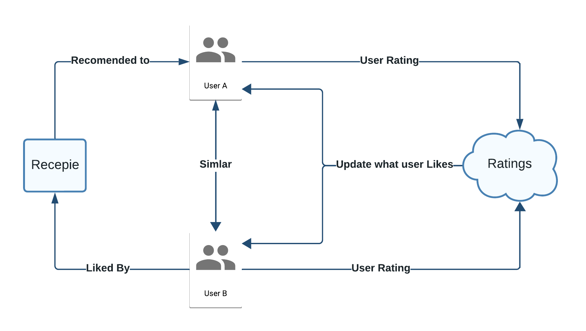
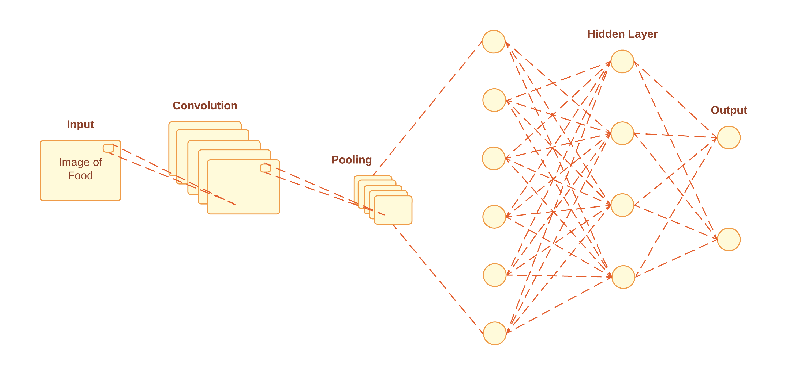

# DeepMinds

Repo for senior design 2

## Members

- [Matthew Munoz](https://www.github.com/MattMunoz) - Team Leader
- [Matthew Nieves](https://www.github.com/Nieves350) - System Savvy
- [Tajwar Rahman](https://www.github.com/thetajwar2003) - Tech Smith

## Timeline for Project (Subject to Change)

[Schedule](https://docs.google.com/spreadsheets/d/1_CTNEVaTbUeiSTDD4i7zU3mf360-n2xHzTq5874sA4o/edit?gid=2016187939#gid=2016187939)

## Project Description

- Recipe App

  - The ML aspect of the project will be implemented on top of a recipe app. The recipe app will work much in the same way other recipe app works. The full details of it can be found [here](https://github.com/thetajwar2003/khuda-lagche)

- Senior Design Project

  1. The main aspect of the project will be a recommendation system that creates personalized recommendations for each user of the app. The users will obtain this personalization based on past preferences, whether it's a like or dislike, compared to what other similar users of the app prefer. For example, if two users have similar tastes in recipes and are more closely related we can assume that they will like a similar recipe in the future, so if one of them likes a recipe the other one has not tried we can recommend said recipe to the other user.

  2. If time permits, the project will also attempt to implement a function within the app that will allow the user to upload a picture of a dish that they tried and would like to know how to make. The app will then identify the dish in the image and provide a recipe to make that dish. Specifically, if a user uploads a picture of a margarita pizza, they can upload a picture of the pizza they like and the app will provide a recipe for the dish.

### Screens

